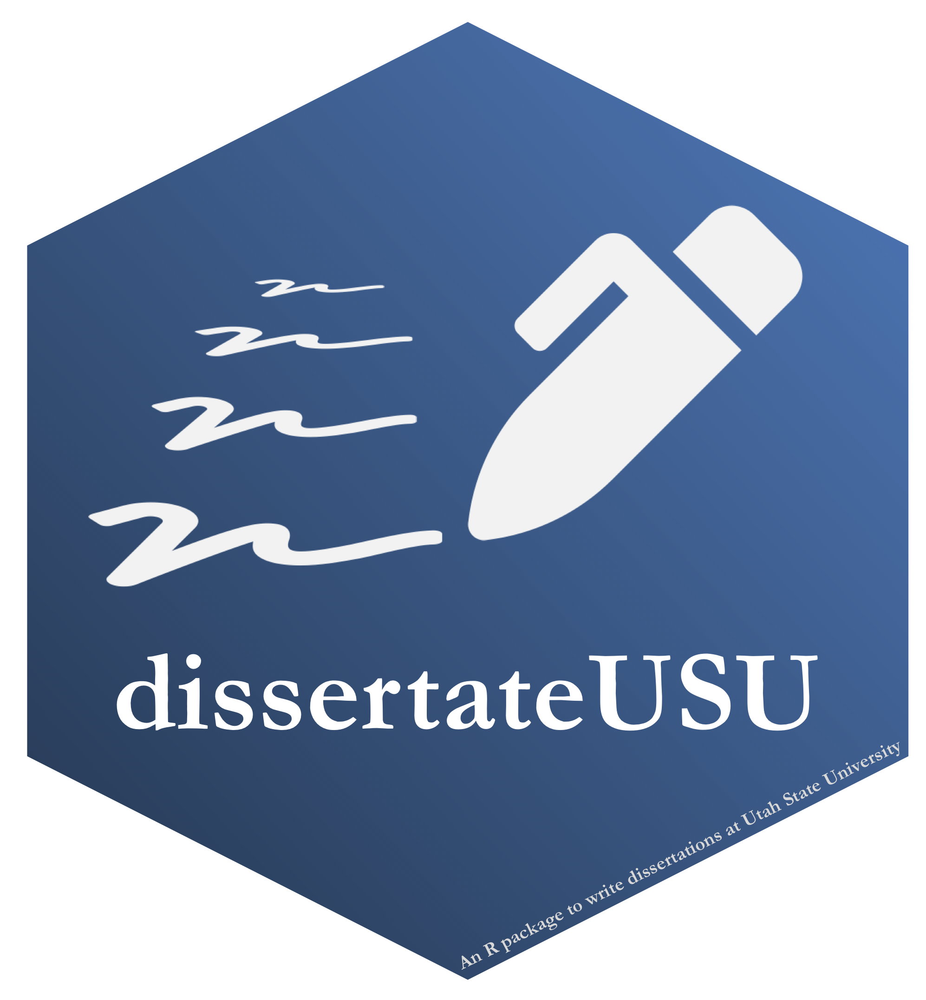
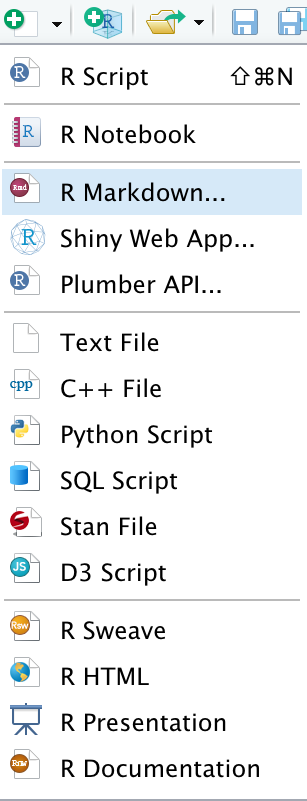
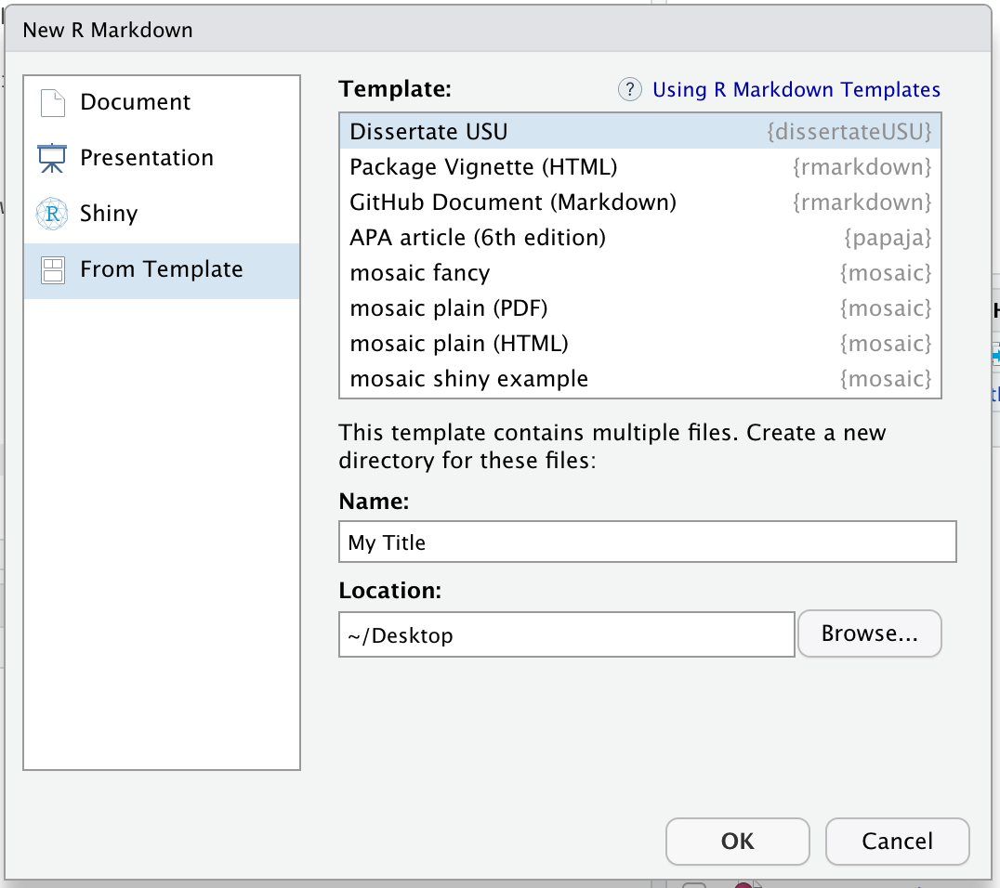
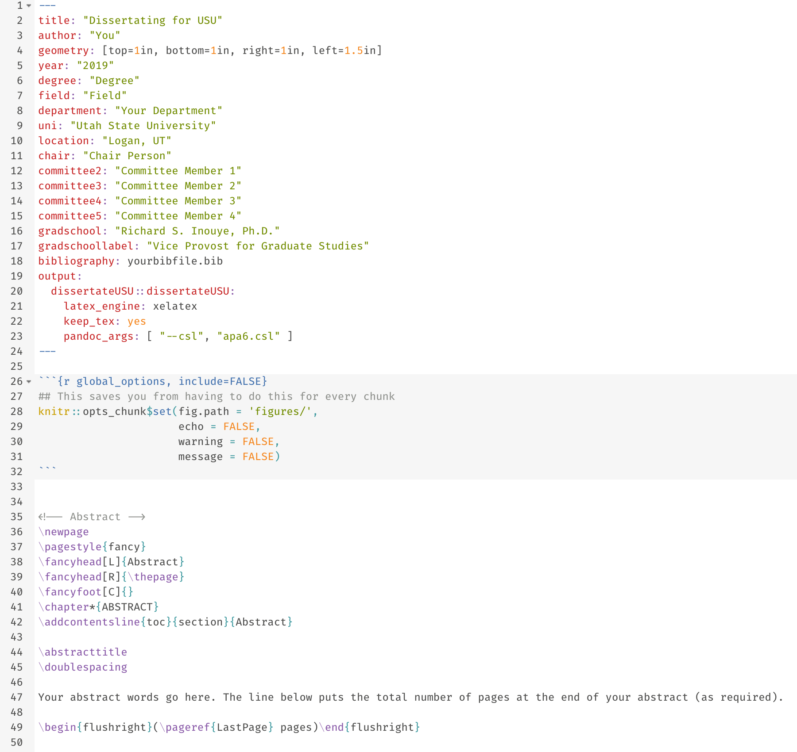
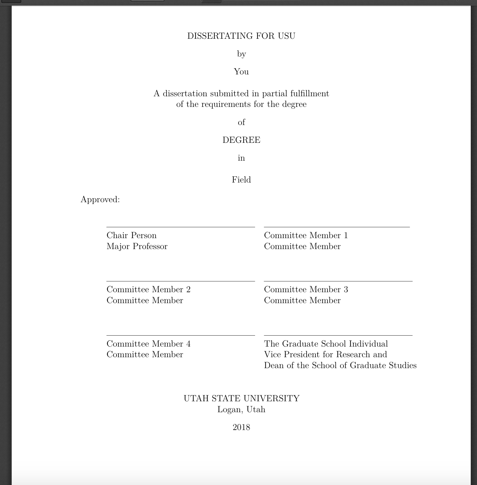
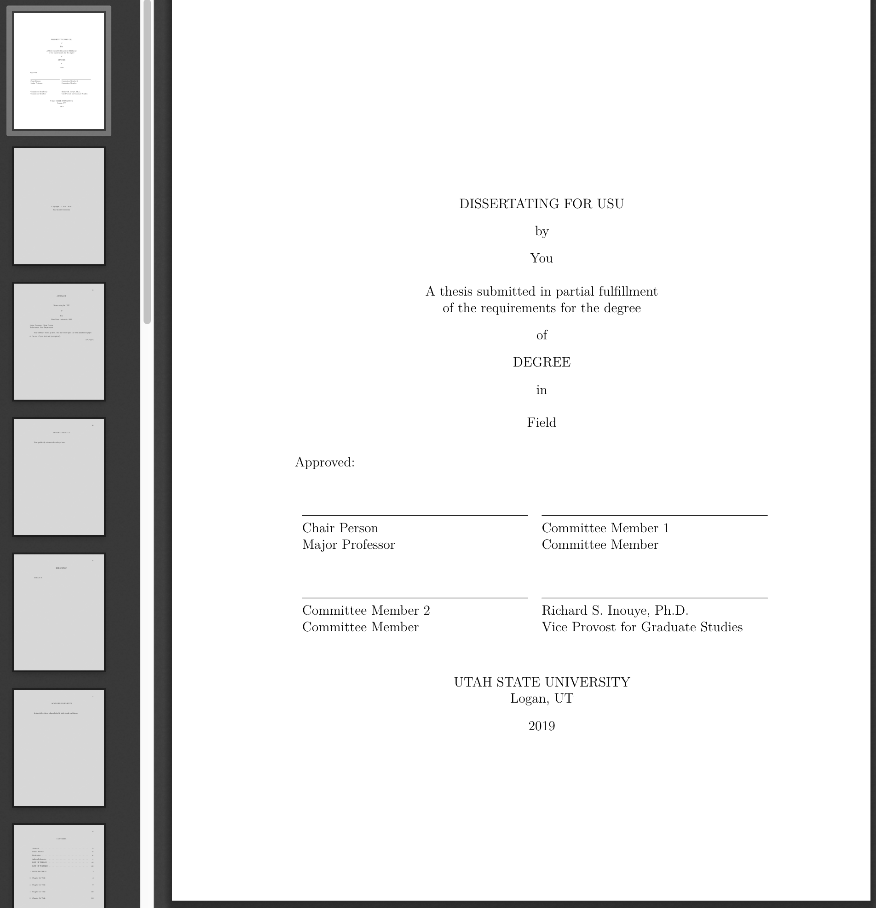

<!-- README.md is generated from README.Rmd. Please edit that file -->

```{r setup, include = FALSE}
knitr::opts_chunk$set(
  collapse = TRUE,
  comment = "#>",
  fig.path = "man/figures/README-",
  out.width = "100%"
)
devtools::load_all()
```

# `dissertateUSU` `v`r packageVersion("dissertateUSU")`` 

The goal of `dissertateUSU` is to make two aspects of writing a dissertation at Utah State University better:

1. Formatting of the dissertation is automatically done for you
2. All analyses are intimately tied to the document making the work more reproducible

Ultimately, this allows the student to focus on the writing and the results without having to worry excessively about updating tables and figures, adjusting formatting of things like the title page and table of contents, and other minor (but important) aspects of getting the document correct.

## Installation

You can install `dissertateUSU` with:

``` r
remotes::install_github("tysonstanley/dissertateUSU")
```

## LaTeX

> Importantly, this package requires the new release of LaTeX from your preferred distribution. Older versions will often encounter an error regarding "\\counterwithin". If this error comes up for you, then you need to update your LaTeX.

## Example

To use the package, after installing it, open up a new RMarkdown file:



and select the "Dissertate USU" template:



This will open up a new folder with a skeleton RMarkdown file:



This produces a document that matches the USU dissertation guidelines:



If you'd rather have the Master's Thesis cover page, just remove the `committee5` and `committee4` lines in the main `.Rmd` file.



<br>

**Some important notes:**

- To put the title on two lines (see the thesis cover page above), use `\newline` at the point where you want the title to split to the second line. In general, USU wants the first of the two title lines to be longer than the second part.
- If you don't need a section (e.g., "Public Abstract", "Chapter 5", etc.), remove it from the main `.Rmd` file. For example, if you want to remove the "Public Abstract", remove all the lines starting from the `\newpage` in that section down to the actual words `Publically abstracted words go here.`. It will then not be included in the knitted document.

## Writing, Writing, Writing

In the folder, there are other RMarkdown files called `Chapter1.Rmd`, `Chapter2.Rmd`, etc. These are the files where you will do the writing and analyzing. The main RMarkdown file will bring all these files together into one document. The only things you need to update in the main RMarkdown file is the `yaml` information, the abstracts, acknowledgments, and dedication.

## Note

The package is still undergoing some development and we would love feedback on any aspect that doesn't work as expected. 

We also want to thank the [`rticles`](https://github.com/rstudio/rticles) package for the functionality for `dissertateUSU`. Many of the functions herein were derived directly from `rticles`, just with a custom template and LaTeX style.

A special thanks to David Jenks for his help finding LaTeX bugs from older LaTeX releases.
